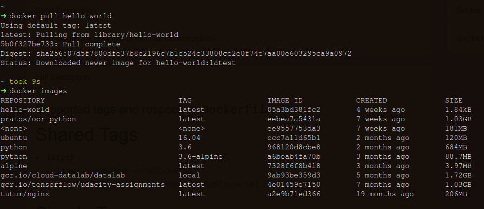
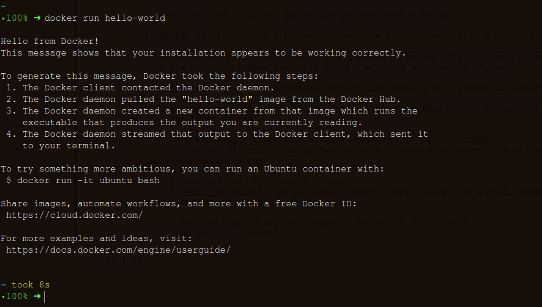
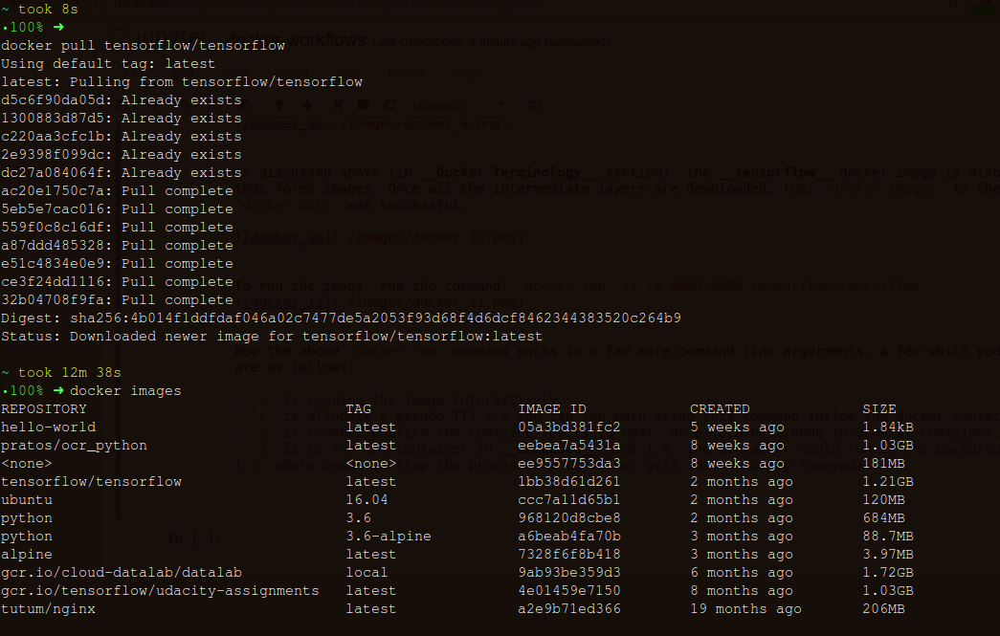
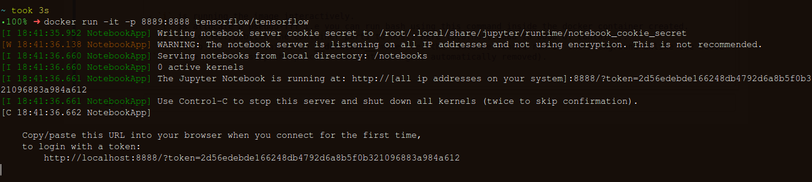
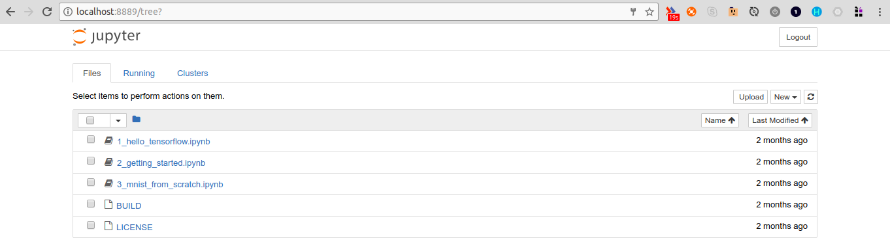
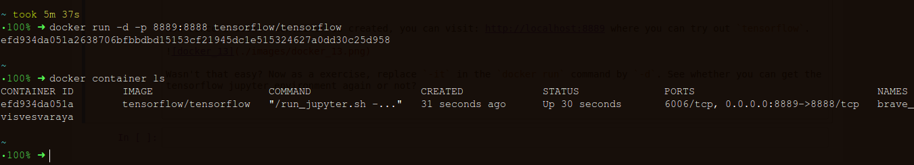
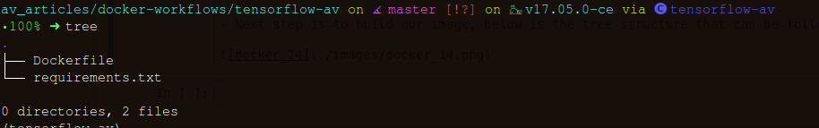
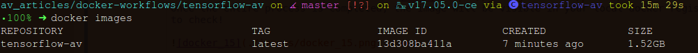
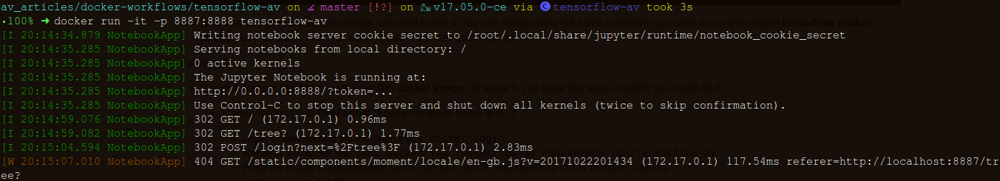

### Docker: Hello-World

- To install __Docker__, below are the links for the major operating systems:

    - [Linux](https://docs.docker.com/engine/installation/)
    - [Mac OS](https://docs.docker.com/docker-for-mac/)
    - [Windows](https://docs.docker.com/docker-for-windows/)

- After installation, to test if __Docker__ has been successfully installed run:


- The above output means that __Docker CLI__ is ready. Next step would be to download an image, now how do we get any __Docker image__. Docker has a repository for that similar to a __github repo__ called __Dockerhub__. Visit [dockerhub](https://hub.docker.com/) to know more.

- After you have logged in, you would see your dashboard (which would be empty at first). Do a quick-search using the __Search__ button and type in: `hello-world`. (Below is my dashboard)


- Searching `hello-world` would give you the results below:


- Click on the first result which also happens to be the official image (created by good folks at Docker, try to use the official images always if there's a choice or create your own). 


- The command: `docker pull hello-world` is what you need to run on your terminal. That's how you download images to your local system.

    - To know which images are already present, run: `docker images`
      


    - Download the `hello-world` image:


    - Run the image using the command: `docker run hello-world`

    
    
This is all we need to execute a _docker image_. _hello-world_ is simple, it has to be, but let's move on to better things. Those that will help more, next section is all about that: __Data Science tools without installation__, our first usecase.

### Data Science tools without installation:

You have a clean laptop and you need to install __Tensorflow__ in your system, but you are lazy (yes we all are sometimes). You want to procastinate and not install things on your laptop, but you have __Docker__ installed already as a standard company practice. _Hmmm, interesting times,you ponder!_

You go to __Dockerhub__ and search for the official __Docker__ image for __[Tensorflow](https://hub.docker.com/r/tensorflow/tensorflow/)__. All you need to run on your terminal is: `
docker pull tensorflow/tensorflow`


As discussed above (in __Docker Terminology__ section), the __tensorflow__ docker image is also a layered object that forms images. Once all the intermediate layers are downloaded, run: `docker images` to check whether our `docker pull` was successful.




To run the image, run the command: `docker run -it -p 8888:8888 tensorflow/tensorflow`


[__NOTE:__ At the time of writing, port 8888 was already used up so running it on 8889. You can run it on any port though `*shrugs*`]


Now the above `docker run` command packs in a few more command line argurments. A few which you need to know better are as follows:

- `i` is running the image interactively.
- `t` is allocate a pseudo-TTY i.e you can run bash using this command inside the docker container created.
- `p` is connect/publish the container ports to host. Here localhost:8888 to 8888 of container.
- `d` is to run the container in __detached__ mode i.e. the container would run in the background unlike the above (`i` where once you stop the process the container gets automatically removed).


Now since a docker container is created, you can visit: http://localhost:8889 where you can try out `tensorflow`.



Wasn't that easy? Now as a exercise, replace `-it` in the `docker run` command by `-d`. See whether you can get the tensorflow jupyter environment again or not?

You should get the following outputs as in the screenshot below:



__Exercise:__ Create more containers with different ports using the `docker run` command and see how many get created.

### Writing Dockerfile for Python Application

After you wrap your ML model in a Flask API, the next step is to convert our Python application (our API) into a Docker application. All you need is just to add: __Dockerfile__ to API [folder root](https://github.com/pratos/datahack2017-workshop-av/tree/master/working_api/working_api). __That's all you need__.

- First thing you need is to create a `requirements.txt` file. For reference, below is the file that you might want to use: [requirements.txt](https://github.com/pratos/datahack2017-workshop-av/blob/master/working_api/working_api/requirements.txt)

- Our __Dockerfile__([an example](https://github.com/pratos/datahack2017-workshop-av/blob/master/working_api/working_api/Dockerfile)) would be comprised of the below components:

    - For the base image, we'll use the __official docker image for python i.e. [python:3.6](https://hub.docker.com/_/python/)__.
    - Command to update the source repositories (the image uses __Debian__ distribution).\
    - Copy the requirements.txt file and _pip install_ the python libraries from the __requirements.txt__ file.
    - Command to __copy__ all the files from local to the docker build.
    - Command to run the `python server.py` command.

- The final __Dockerfile__ would look as below:

```
# Base image
FROM python:3.6

RUN apt-get update -y

COPY requirements.txt requirements.txt
RUN pip install --no-cache-dir -r requirements.txt

ENV INSTALL_PATH /working_api

RUN mkdir -p $INSTALL_PATH

#Why we need the below:::https://ganesshkumar.com/2016/07/10/docker-disable-python-buffer.html
ENV PYTHONBUFFERED=0

COPY . $INSTALL_PATH

WORKDIR $INSTALL_PATH

CMD ["python", "server.py"]
```

- Next step is to build our image, below is the tree structure that can be followed(screenshots temporary):



- To build the image, run: `docker build -t workingapi .` (__Note:__ `-t` is to tag the image as you wish too. You can version it as well, eg: `docker build -t workingapi:v1 .`

- The logs for all the run is provided [here](https://gist.github.com/pratos/1514a82940277f850d25f68b320437e3). Once the entire process is completed, the image will be visible in your local docker registry. Run: `docker images` to check!




- Now that you have created the image, we need to test it. Run the image using the same command you used to run the original __ML API docker image__. Run: `docker run -p 5000:5000 -d workingapi:v1`




- Congratulations! You have made your first __docker image__. To share it, you have two ways in which you could do it:
    * Upload the image to __Dockerhub__.
    Follow the steps below to do it:
        
        - Login to __Dockerhub__ via terminal: `sudo docker login`
        - Rename the docker file: `sudo docker tag workingapi:v1 <dockerhub-id>/workingapi:v1`
        - Push the image to __Dockerhub__: `sudo docker push <dockerhub-id>/workingapi:v1`
    
    * Export the image to __.tar file__.
        
        - `docker save <dockerhub-id>/workingapi:v1 > <path>/workingapi-run1.tar`
    
    * We can even export the container to a __.tar file__, along with all the running instances/state and other meta-data.
        - `docker export <container-id> > <path>/workingapi-run1.tar`


### Deploying it to Cloud via `docker-machine`:

- To create a VM via `docker-machine`, refer [this document](https://github.com/pratos/datahack2017-workshop-av/blob/master/docker-machine-hello-world.md) and section titled: __Initializing VM in Cloud Example:__

- If you check the images present (via `docker images`), you'll realize that this is a clean slate and you need to build the contents in your working api folder again.

- Now to build the contents in the folder again, run: `docker build -t workingapi:v1 .`

- Once done, run: `docker images` once again and you'll see your new `workingapi` Docker image present here.

- All you need to do now is run: `docker run -p 5000:5000 -d workingapi:v1` and check the `ip` of the VM. Your API has already been deployed.